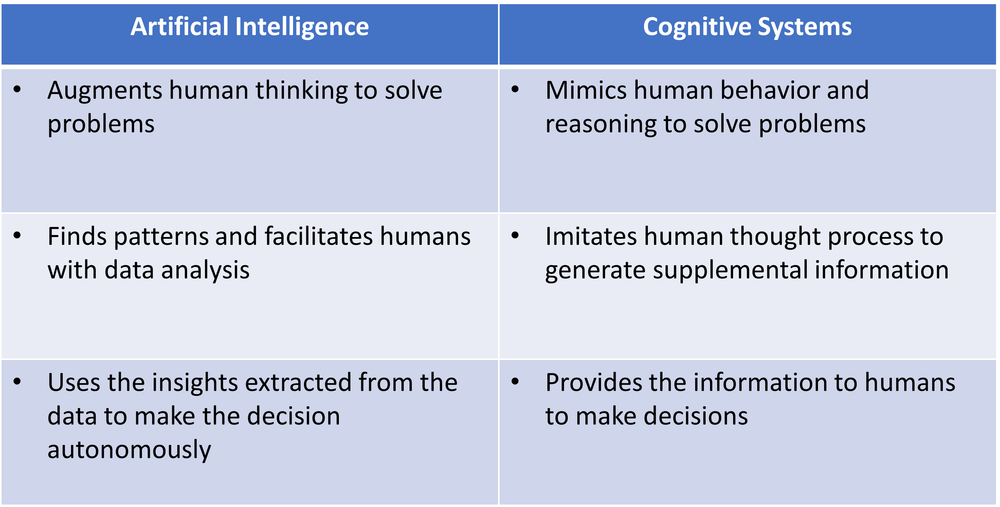
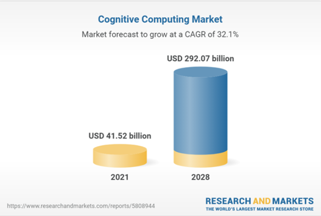
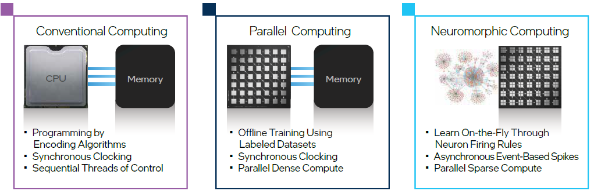
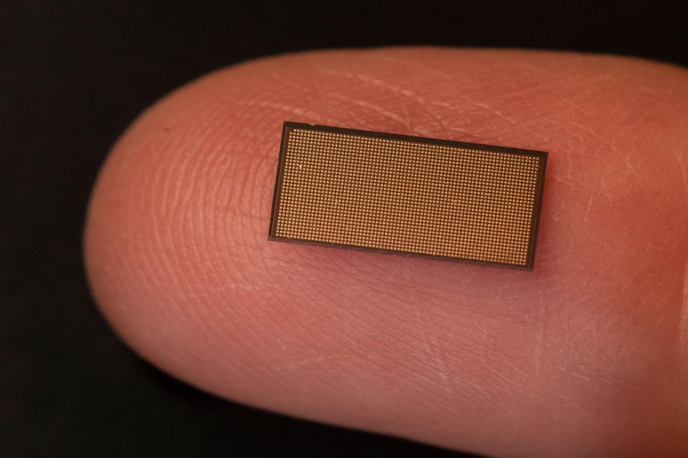

**Cognitive computing technologies are fundamentally different from all other forms of computing seen so far. They aim to continually learn from the interaction between data (structured and unstructured), context, and people, to improve learning and reasoning capabilities over time.**

Similar to how human learning evolves from birth to adulthood, a cognitive system learns and becomes more intelligent over time from the information it gains each time it interacts with its environment and the experience it accumulates.

This paradigm shift from rule-based computing to autonomous learning and reasoning is changing computing forever. With the advent of Big Data, cognitive systems promise to unlock a vast amount of knowledge now hidden under the rich and huge amount of data that business organizations generate.

Despite its potential to ripe huge benefits, implementing cognitive computing capabilities at the enterprise level requires a major shift in the way organizations approach problems, use technologies, and run their operations.

## What Is Cognition and Cognitive Systems?
A cognitive system is a way different from automated systems.
Conventional automated systems are not able to perceive or communicate human emotions. Basically what they do is process “if-then-what” conditions.
Instead, cognitive systems mimic some aspects of human thought: they can learn, reason in some way, and suggest responses, incorporating emotional elements into their interaction with humans.

While automated systems are preconfigured and coded by humans and follow rigid rules, cognitive systems can define their own rules through continuous learning and experience.

Cognition is also different from AI.

The former emphasizes the learning process and recalls any facts that it has previously learned. AI is the ability of a machine to understand and decide what action to take and when among the given options, but it needs a set of well-defined rules codified by a human being.

In other words, AI is based on the human being’s perception and anticipation of possible complex scenarios and their ability to codify them in a system (Fig.1).

Fig.1 Differences between Artificial Intelligence and Cognitive Systems (Source: own elaboration)

## How Cognitive Computing Works?
Cognitive computing is based on computer systems that mimic the human brain; that is, they have the ability to process natural language, learn from experience, interact with humans, and make decisions based on what they learn.

Cognitive computing systems are therefore learning systems that use a wide range of principles and techniques from cognitive science, neuroscience, data science, nanotechnology, machine learning, and cloud computing.

Cognitive systems incorporate integrated data analytics (including algorithms, machine and deep learning) and automated reasoning and decision that enable iterative interaction with the outside world to capture and analyze data, reason to hypothesize, learn from experience, and interact with humans naturally to achieve specific goals.

Throughout a learning process, cognitive computing systems improve over time and produce their own knowledge, reducing errors and improving the quality of analysis and predictions.

Cognitive systems are not programmed by default but can improve themselves by learning through incremental interactions and training based on previous experiences and data sets.

Therefore, unlike conventional programmable computers, cognitive computing is not limited to deterministic constraints, but has a dynamic essence by continuously detecting and learning from the environment and improving its decision-making capabilities autonomously.

By learning from past errors and successes, cognitive systems enable humans to discover new relationships and behaviors that would otherwise go unnoticed in a large volume of data.

Sounds like it's science fiction, right? But no, cognitive computing is no longer a myth at all, but a real technology that companies should start thinking about how they can benefit from on their transformation journey.

## A Multi-Billion Dollar (and Growing) Industry
The cognitive computing market was valued in 2021 at US$41.519 billion according to Knowledge Sourcing Intelligence, and is projected to expand at a Compound annual growth rate (CAGR) of 32.14 % to reach US$292.069 billion by 2028 (Fig.2).

Fig. 2 Cognitive computing expected market growth (Source: Research and Markets citing Knowledge Sourcing Intelligence)

Among the factors that are most expected to drive this sustained growth of cognitive computing in the next years are the strong penetration that artificial intelligence is having in business, as well as integrated cloud computing platforms.

The cognitive computing industry is already part of the core strategy of technology giants, such as IBM Watson, Microsoft Azure Cognitive Services, Intel Labs, NVIDIA, Cognitive Security (acquired by CISCO)), Hewlett Packard Enterprise, etc., and a good number of start-ups have emerged developing strong capabilities in cognitive computing, including DeepMind (adquired by Google in 2014), SparkCognition, Numenta, MindFabrik UG, EXPERT SYSTEM COGITO LTD, to name just a few.

## What's In For My Business?
The appetite of business organizations to be increasingly smart is translating into the development of a wide range of solutions based on Big Data, artificial intelligence and cognitive computing. This increasingly demanded "smartness" ranges from recommender systems, smart detection devices, and automated call and response centers, to autonomous vehicles, robots, or smart cities and facilities and infrastructure capable of responding in adaptative ways.

Most of the demos presented by major IT companies include use cases that operate in a real world environment that is unpredictable, and where power, latency and data limitations are present.

You can also think of cognitive computing solutions as a way to increase the productivity of your workforce and provide better customer service by automating repetitive and lower-value tasks and extending your employees' thinking capabilities and overall contribution to business objectives.

Cognitive computing helps employees determine what information is needed to solve a problem, thus simplifying the data capture process. But this alone might not be enough, it is also capable of reasoning with a high degree of independence while testing hypotheses, validating or rejecting alternative scenarios, and learning. In this way, cognitive computing can be used to recommend possible courses of action to us (i.e. how to customize a product or service?), keeping people ultimately responsible for decision making.

Just think of the myriad of possible use cases that can arise from the power of cognitive computing. The list is definitely so long that I prefer to skip it and let your imagination do the rest.

## What to Expect in the Near Future?
New hardware, programming languages, and applications are being developed by the IT industry to push cognitive computing development forward.

The new hardware will include neuromorphic machine technologies inspired by the form and function of the brain’s biological neural networks to process sensory data (e.g., images and sounds), and respond to changes in the data in ways not specifically programmed.

Research is currently underway on new neuromorphic chips that can overcome physical limitations and considerably reduce the power requirements of traditional processors. Neuromorphic computing represents a fundamental rethinking of computer architecture at the transistor level, and is unmatched in its ability to intelligently process, respond to, and learn from real-world data at millisecond response levels (Fig.3).

Fig.3 Differences between conventional, parallel and neuromorphic computing (Souce: Intel) 

In 2017, the microprocessor manufacturer Intel Corporation developed Loihi, a neuromorphic chip with 128 cores and 130,000 neurons, which integrates memory, computing, and communication and works in parallel. In 2021, Intel introduced its second-generation neuromorphic chip Loihi 2 (Fig.4), together with Lava, an open source software framework for developing neuro-inspired applications.

Fig.4 Loihi 2 neuromorphic chip (Source: Intel)

According to the information provided by Intel Corporation, Loihi outperforms its predecessor by up to 10x and is capable of accelerating learning in unstructured environments that require autonomous operation and continuous learning, with low power consumption. Among the declared use cases for this technology are voice and gesture recognition applications, vision, robotics, and constrained optimization problems.

Additionally, Intel Labs, the research arm of Intel Corporation, has established the Intel Neuromorphic Research Community (INRC) as a collaborative research environment that brings together academic, government, and industry research teams from around the world with a view to overcoming the challenges of neuromorphic computing.

The confluence of cognitive technologies with Big Data, analytics, the IoT, and cloud computing will greatly expand the number of applications and the impact of cognitive computing.

## Conclusion
Cognitive systems open up a unique combination of analysis, problem solving, and communication with humans in a natural way that represents new pathways for human-machine interaction, turning machines into allies to increase human reasoning ability and support smart decision-making.

Why not think that the old dilemma of whether man or machine will eventually prevail will lose relevance and give way to a new era in which machines will not replace humans but will join them to expand their capabilities and make them make better decisions by leveraging big data analytics?

Perhaps with cognitive computing we have reached a tipping point in making it possible for humans and machines to work together to extend human capabilities, especially those associated with knowledge, finding relevant patterns in dynamic big data, and making optimal decisions; and pave the way for the discovery of a new generation of cognitive products.

For the moment, what seems clear is that in the course of the next few years a new generation of cognitive devices and systems will be developed that will be the result of the fusion of cognitive technologies with new tools and devices that will allow users to easily interact in a kind of continuous and dynamic “conversation” with technologies that will impact on the operational processes and decision-making systems of most business organizations.

Photo by jcomp <a href="https://www.freepik.es/foto-gratis/cerebro-escribe-tiza-blanca-mano-dibuja-concepto_6170400.htm#&position=0&from_view=search&track=ais" target="_blank">Freepik</a>
