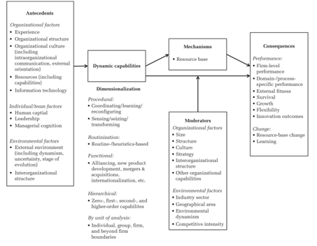
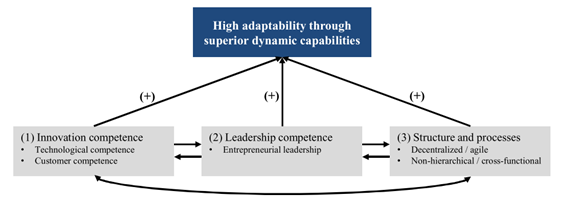

**In today's business environment marked by strong competition and continuous pressure for organizations to transform and not stop innovating, an endless number of new difficulties and challenges arise that transformational leaders must manage.**

Companies need to constantly adjust their strategies to remain relevant, and having a solid [business transformation strategy](https://frontiersinbusinesstransformation.com/posts/setting-up-a-successful-business-transformation-strategy/) that is well aligned with the rest of the organization's strategies becomes essential.

In this complicated game, it is crucial that transformational leaders effectively manage the set of capabilities that organizations possess to respond to environmental changes and maintain a high level of performance.

## What Are Dynamic Capabilities?

With that in mind, transformational leaders must begin distinguishing between two main types of organizational capabilities: 1) operational capabilities, that is, those intended to maintain and support the company's current exploitation activities, products, and customers, and 2) dynamic capabilities, those oriented toward strategic change.

A dynamic capability is the ability of an organization to deliberately create, increase or modify its operational resource base.
Through a dynamic capability the organization can systematically modify its operational routines and resource configurations in search of greater effectiveness and better performance as the environment changes or evolves ([Figure 1](#dc)).

Figure 1.
Framework of dynamic capabilities Source: Schilke, O., Hu, S., & Helfat, C. E.(2018).Quo vadis, dynamic capabilities?
A content-analytic review of the current state of knowledge and recommendations for future research.
Academy of management annals, 12(1), 390-439.

By identifying the dynamic capabilities of the organization and establishing a shift in the resource base, transformational leaders are better able to boost business transformation processes, positively impact performance, and secure competitive advantages for the company.

> It is crucial that transformational leaders effectively manage the set of capabilities that organizations possess to respond to environmental changes and maintain a high level of performance.

Given the importance and relevance of dynamic capabilities for the present and future work of transformational leaders, this article examines the nature of dynamic capabilities and provides an introductory analysis of how they can boost business transformation and create competitive advantages in a changing and challenging business environment.

## The Role of Dynamic Capabilities in Transformation

The dynamic capabilities of an organization are those that support the capacities of sensing, seizing, and transforming.

-   **Sensing capabilities** enable the organization to appropriately manage new opportunities that are volatile, including the ability to identify and understand changes in the environment to act on them.
    Environmental changes may include those related to new technologies, customers, competitors, etc.

-   **Seizing capabilities** allow the organization to identify and analyze the relevant sources of change and then find the best answer to them, identifying the gaps that exist in the organization's capabilities in order to fulfil them effectively.

-   **Transformation capabilities** align the organization's responses and resources with the [business transformation strategy](https://frontiersinbusinesstransformation.com/posts/setting-up-a-successful-business-transformation-strategy/).
    In this way, the organization can identify gaps in its skills and knowledge base and develop the necessary competencies to address transformation initiatives.

In summary, dynamic capabilities can be understood as the amalgamation of capacities and skills with which an organization generates, identifies, and analyzes new knowledge and integrates it into the organization's routines with the purpose of positively affecting the company's performance.
For this, the organization will need to sense its environment, facilitate new learning processes, and activate both internal and external interaction processes.

## Dynamic vs Operational Capabilities

Developing dynamic capabilities has captured the attention of many transformational leaders because they can offer a route to competitive advantage under conditions of uncertainty and change, a goal that for many business leaders is the Holy Grail of strategic management.

Since its introduction in 1994, numerous studies have shown that those organizations that develop dynamic capabilities are able to respond in a more timely and rapid way to product innovation, exploit new opportunities more flexibly and reorganize and deploy their internal and external competencies faster according to the needs of the changing environment.

> By identifying the dynamic capabilities of the organization and establishing a shift in the resource base, transformational leaders are better able to boost business transformation processes and positively impact performance

My recommendation is that modern transformational leaders get to work on developing and establishing dynamic capabilities in their organizations, particularly in the context of their business transformation strategies and on those areas where companies need to orchestrate multifaceted, data-rich digital resources.

However, developing dynamic capabilities is neither quick nor easy to achieve.
Very often, the routines established in organizations, the installed culture and the resources that support the operational activities of the company inhibit the development of dynamic capabilities.

Ultimately, this means that, although some companies manage to build and integrate some dynamic capabilities, they frequently fail to reconfigure the organization according to new market needs due to a relentless focus on their operational capabilities.

## Determinants of Dynamic Capabilities

If companies aspire to remain relevant and improve their performance in an environment full of challenges and uncertainties by developing dynamic capabilities, that is, if they deliberately seek to create advantages by adding unique value to the company through systematic changes in resources that are difficult to imitate, the next question is: **what are the key determinants of dynamic capabilities?** ([Figure 2](#dc2)).

Figure 2.Determinants of dynamic capabilities

Source: Wittenstein, D.(2022).Champions of digital transformation?T
he dynamic capabilities of hidden champions.
In Managing Digital Transformation: Evidence from Hidden Champions and Measurement Approaches (pp. 35-73).Wiesbaden: Springer Fachmedien Wiesbaden.

One of the first determinants has to do with the organization's capacities to learn and innovate.
Dynamic capabilities are based on deliberate learning and learning-by-doing, or both, which enable transformational leaders to flexibly reconfigure the company's resources and create new knowledge to exploit opportunities.

For organizations to learn how to learn and innovate, it is important to have leaders with skills that allow them to discriminate routines, decide investments, and orchestrate intangible assets that generate efficiencies and returns.
In particular, the development of entrepreneurial leadership by transformational leaders can help companies sense new opportunities, seize them, and transform by focusing on innovative solutions to future challenges.

> My recommendation is that modern transformational leaders get to work on developing and establishing dynamic capabilities in their organizations, particularly in the context of their business transformation strategies

The development of agile practices in the organization and its processes also help to boost dynamic capabilities.
Through agility, the company can promote the exchange of innovations and knowledge between the functions and units so that sensing, seizing, and transforming capabilities take place more quickly and effectively throughout the entire organization.
Decentralization efforts that promote coordination skills and realignment of available resources can also contribute to the above.

## Domains of Interest

The domains of interest for the development of dynamic capabilities span multiple levels and encompass both the definition of strategies and organizational processes.

One of the most typical functional domains in which the value of developing dynamic capabilities is perceived is new products development.

Those domains related to the firm's search for resources outside its boundaries are also of great interest for the development of dynamic capabilities, such as internationalization, diversification, mergers and acquisitions, and alliances.

> Dynamic capabilities are based on deliberate learning and learning-by-doing, or both,

The areas of operations management and marketing are also areas in which it makes perfect sense to develop dynamic capabilities, since they require strong innovation routines and a constant realignment of resources in the face of the changing environment and variable customer demands.

## Conclusion

Dynamic capabilities articulate how companies create, expand and protect intangible assets that drive superior long-term business performance, and implement mechanisms to adapt to highly uncertain and challenging environments.

The development of dynamic capabilities provides a systematic and coherent response to the demanding management needs of modern transformational leaders, who are under increasing pressure to prioritize short-term growth actions, while also being required to develop operational capabilities and organizational resources that generate long-term returns.
This alone justifies that transformational leaders strive to acquire and strengthen dynamic capabilities in their organizations.

Transformational leaders increasingly realize that their organizations need to continually identify and gather new information about the complex environment around them and be able to quickly transform this knowledge into new resources and capabilities.
This inevitably requires organizations to become agile and [ambidextrous](https://frontiersinbusinesstransformation.com/posts/managing-business-transformation-with-ambidexterity/) to seize new opportunities and adapt their business models and work processes to the new knowledge so acquired.

However, not all organizations are capable or successful in developing purposeful dynamic capabilities.There are often many barriers that hinder the path of change.
Even more so if one considers that dynamic capabilities can only be built over time and cannot be replicated or acquired in the market.

It is worth being aware of the opportunities and benefits that accompany the development of dynamic capabilities, but it is also necessary for transformational leaders to become familiar with how to drive the growth of dynamic capabilities in their companies.
This way it would be much easier to appreciate the value of the dynamic capabilities perspective and get to work on it.

Photo by master1305 <a href="https://www.freepik.es/foto-gratis/retrato-dinamico-joven-mujer-bailando-hiphop-aislado-sobre-fondo-negro-efecto-luces-mixtas_27425932.htm#query=dynamic&position=4&from_view=search&track=sph" target="_blank">Freepik</a>

