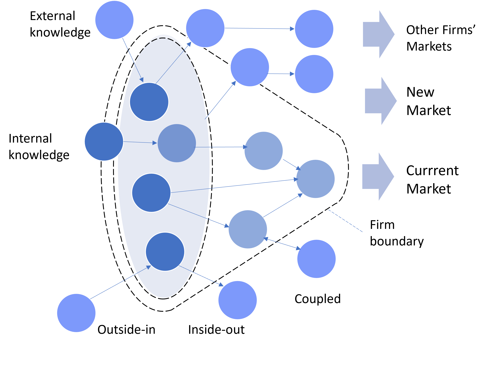

**The complex environment in which most business organizations operate around the world has made the practices that lead to open innovation become an essential tool for any transformational leader who relies on the potential of external ideas, knowledge, and technologies to create value.**

Organizations with greater external knowledge and skills are in a better position to make faster decisions and adapt their operating frameworks to changes in the environment and threats from competitors. Ultimately, inbound open innovation processes positively influence organizational agility, while the latter improves inbound open innovation.

Not surprisingly, many transformational leaders are increasingly motivated to integrate open innovation into their overall business transformation strategy and combine external resources and skills with their internal capabilities, implementing specific processes that enhance learning and collaboration through networks and ecosystems.

This seemingly simple yet powerful paradigm of open innovation that focuses on leveraging and enhancing the company's internal innovation capabilities and exploring new business models has thus become an imperative for orchestrating business innovation and transformation.

## What Does Open Innovation Work?

Open innovation is a way of organizing innovation built on the idea that organizations should use both internal and external ideas, knowledge, and technologies to improve their innovation activities. As such, open innovation assumes that the best ideas for innovation are unlikely to come from a single firm, nor do the most talented people work for only one organization.

> Open innovation has become an imperative for orchestrating business innovation and transformation

Implicit in open innovation is the idea that no firm can truly innovate in isolation, but rather must engage with a plethora of actors and partners to acquire ideas and resources from the external environment that ultimately help the organization stay ahead of competitors. Hence, open innovation enriches the traditional innovation funnel, where the boundaries are typically closed, by bringing the external environment inside the funnel, so that innovations can even be exploited outside the firm ([Figure 1](#openinnovation)).

According to the open innovation paradigm, organizations should not rely solely on their own internal research and ideas but also seek outside sources that can boost their innovation. While the outside-in (or inbound) direction is perhaps the best known and most developed mode of open innovation, it is not the only one. There is also an inside-out (or outbound) mode and a coupled mode, which involves combined inputs and outputs of knowledge between innovation actors ([Figure 1](#openinnovation)).

Fig.1 The open innovation model. Source: own elaboration based on Chesbrough & Bogers (2014). Explicating open innovation: Clarifying an emerging paradigm for understanding innovation. In New Frontiers in Open Innovation (pp. 3--28). Oxford University Press.

The inside-out mode considers the firm's intellectual property (IP) as an enabler to access external ideas and allow others to use the firm's own ideas. This is possible because there are intellectual property rights (IPR) that grant their owners the right to exploit and share them with third parties under the established terms.

> Open innovation is a way of organizing innovation built on the idea that organizations should use both internal and external ideas, knowledge, and technologies to improve their innovation activities

The combination of the outside-in and the inside-out modes leads to the so-called coupled mode of open innovation. This mode requires that both processes occur simultaneously, which usually calls for some type of partnership agreement between firms, such as strategic alliances, joint ventures, or spin-offs, to jointly develop and commercialize innovations.

## Open Innovation with Agility

Open innovation includes a wide variety of different activities, from collaborations between industry and academia, to the development of open source software, crowdsourcing, or the relationships between corporations and start-ups.

There are firms that are even using open innovation within the more general framework of (corporate) innovation and entrepreneurship activities to drive change in organizational culture, such as when developing new products and services that involve multiple groups of stakeholders (e.g., customers, suppliers, competitors) with a view to increasing the efficiency and effectiveness of new development processes.

> According to the open innovation paradigm, organizations should not rely solely on their own internal research and ideas but also seek outside sources that can boost their innovation

The above basically means that the open innovation paradigm shares many principles and practices with the Agile framework. Both aim to tear down corporate silos, strengthen open communication and collaboration between teams and people, and respond swiftly to changes in user/customer needs and preferences, and threats from competitors.

User/customer engagement is continuous during the development of open innovation and takes place from the very beginning. Digital tools ensure that sharing and collaboration are much easier and that there is an open dialogue between the firm and the key stakeholders along the process.

## Tips for Adopting Open Innovation with Agility

To harness the potential of both inbound open innovation and Agile principles, the firm must develop a culture and organizational set-up that addresses the following critical issues.

-   **Management must buy in:** To combine open innovation with Agile principles and scale any mixed initiative across the organization it is critical to gain the commitment and buy-in of the firm's top management. When top management understands both Agile and open innovation principles and shares the overall goals of the combined initiatives, it is possible to secure the necessary resources to drive open innovation and make critical decisions when needed.

-   **Legal problems must be solved:** A common concern of top management when dealing with the open innovation paradigm is the protection of the resources at stake, especially those related to the protection of intellectual property. Questions about how to protect certain data or information, how to establish collaboration agreements with other firms, and how to manage patents and other rights and obligations must be resolved beforehand.

-   **Operational issues must be handled:** To act openly, with agility, and more focused on the needs of users/customers, it is vital to align the firm's operational processes in a different way. The firm will need continuous and deeper access to its customers and users to gain insight about their needs and preferences, it will have to collaborate with other actors with different goals and business models, and incentivize its workforce to share and collaborate, among other things.

-   **Proactive change management to involve all stakeholders:** When the firm decides that it is going to implement the open innovation paradigm with Agile principles, all stakeholders must get involved. However, not everyone is ready to work in this way initially. Some won't know how to do it, others won't be able to, and there will surely be those who just don't want to do it. This is why the firm must perform proactive change management for all stakeholders to adapt to the new structure of values of the organization.

-   **Decide when to be open and Agile:** It is not always in the firm's interest to adopt an Agile and open innovation approach. Many times, it can happen that a closed and traditional (waterfall) approach is more appropriate for what the firm needs. Sometimes making the transition to a new culture, new processes, or changing people's beliefs, habits and customs is simply an exaggerated effort that the firm cannot afford or does not want to make. Firms must be very aware of the pros and cons of implementing open innovation and Agile practices and decide when the best time is to move forward.

A common way to address the main issues mentioned above is to embed Agile principles into the hierarchical structures of the organization and progressively move step by step to achieve the desired goals.

> The open innovation paradigm shares many principles and practices with the Agile framework

Transformational leaders truly committed to open innovation will need to play a leadership role that understands, reflects, and promotes people's learning and creativity and promotes the development of key skills for everyone in the organization with the aim of creating competitive advantages for the organization.

The drawbacks and limitations that the combination of open innovation and organizational agility entails for most organizations remains to be seen, as more research is needed on this topic.

## Conclusion

Although there are many business organizations that are fully aware of the usefulness of the open innovation paradigm to drive the transition towards a smart organization, the problem is that most of them usually do not have the capacity to put it into practice.

Implementing an open innovation strategy in firms little or not used to opening their boundaries to the world and given the number and depth of the factors involved, implies a high complexity. This situation becomes even harder when transformational leaders must align the open innovation strategy with the firm's general business and IT strategy.

Despite the obvious difficulties, transformational leaders would better be convinced that the development of open innovation is essential to guarantee the continuity of the organization.

Photo by pch.vector <a href="https://www.freepik.es/vector-gratis/bote-remos-equipo-negocios_6974857.htm#query=leadership&position=33&from_view=search&track=sph#position=33&query=leadership" target="_blank">Freepik</a>

