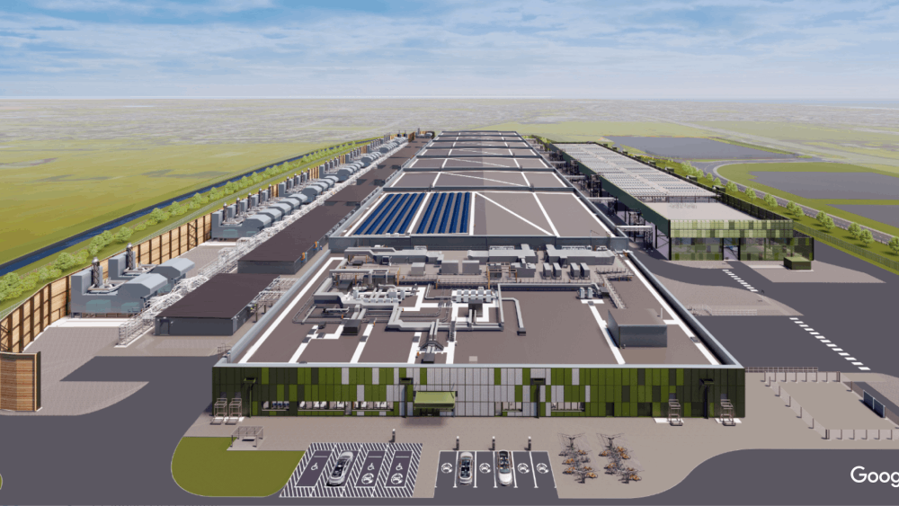
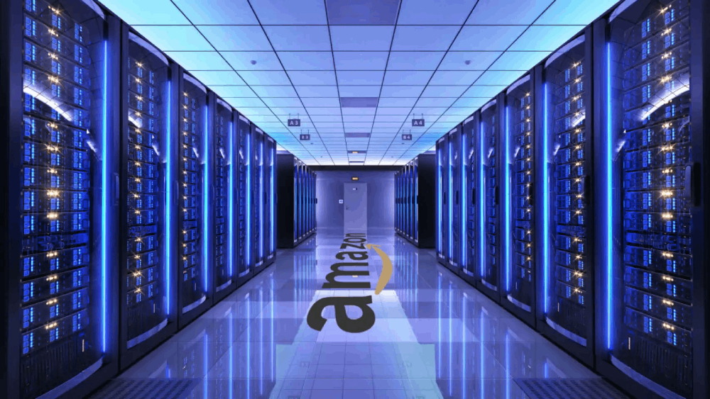

**In the wake of the digital revolution, our world has undergone a profound transformation, marked by an insatiable demand for digital services and data. From the surge of the internet era to today's data-driven society, the exponential growth in data usage and storage has cast a looming shadow on global energy consumption.**

As digital services become increasingly integrated into our daily lives, the energy demands of data centers, the backbone of this digital ecosystem, have skyrocketed. According to a report by the International Energy Agency (IEA), global data center electricity consumption surged by 40% from 2013 to 2020, reaching over 200 terawatt-hours (TWh) annually. This exponential growth in energy consumption mirrors the escalating demands of data usage and storage, underscoring the urgent need for sustainable solutions in the digital age.

Let's delve into the challenges posed by the escalating demand for energy provoked by digital transformation and examine the pivotal role of transformational leaders in pioneering solutions to mitigate its impact.

## Digital Services Fueling Data Centers' Growth

Over the past 3 years, the surge of digital services has accelerated, driving an exponential growth of data centers worldwide. According to a report by Statista, global data center IP traffic is projected to reach 20.6 zettabytes by 2024, reflecting a staggering 32% compound annual growth rate. This explosion in data usage, fueled by advancements in cloud computing, artificial intelligence (AI), and the Internet of Things (IoT), has spurred the construction of new data centers across diverse geographies.

Figure 1.
Google's new $1bn data center in UK. Source: Google

Countries like the United States, China, and India have witnessed a flurry of data center developments, catering to the escalating demands of digitalization. In the United States alone, tech giants like Google, Facebook, and Apple have collectively invested over USD120 billion in data center infrastructure to support their expanding cloud services and digital platforms. Similarly, China has witnessed a rapid increase in data center development, with investments totaling more than USD30 billion from companies like Alibaba and Tencent. In India, the government's Digital India initiative and increasing internet penetration have attracted investments of approximately USD15 billion from domestic and international players such as Reliance Jio and Amazon Web Services. As the digital economy continues to evolve and expand, the need for robust and scalable data center infrastructure will remain paramount to support the increasingly data-intensive applications and services of the future.

## Why Are Data Centers So Energy Voracious?

Understanding the voracious appetite of data centers for energy is key in addressing their environmental impact. These facilities house a multitude of servers and IT infrastructure, requiring constant cooling and power supply to maintain optimal performance, which, coupled with their heavy reliance on fossil fuels, leads to significant greenhouse gas emissions, notably CO2, worsening climate change.

Data centers operate 24/7 to ensure uninterrupted access to digital services, which necessitates significant energy consumption for running servers, cooling systems, and other supporting infrastructure. Servers generate heat during operation, and cooling systems are essential to prevent overheating and ensure the reliability of equipment. Additionally, data centers require high-capacity electrical systems to provide uninterrupted power supply, often utilizing backup generators or battery systems to mitigate the risk of power outages. This continuous operation and high-power usage stress substantial energy demands, making data centers one of the largest consumers of electricity globally.

Figure 2.
Inside Amazon's data center. Source: Google

With the proliferation of AI applications, data consumption and storage needs have surged even higher, leading to unprecedented levels of energy consumption. To put this into perspective, the energy consumption of a single large data center can rival that of a small city. Consider the case of the Dalles Data Center in Oregon, USA, which consumes an estimated 250 megawatts of electricity, equivalent to the energy needs of approximately 180,000 homes.

This underscores the substantial impact of data centers on energy resources and emphasizes the urgent need for sustainable solutions to mitigate their environmental footprint. As digital services will continue to evolve and expand, finding sustainable solutions to meet the escalating energy demands of data centers becomes imperative for environmental stewardship.

## How Is the Technology Industry Pioneering Solutions?

Tech giants like Microsoft, Amazon, and Google are spearheading initiatives to mitigate the environmental impact of data centers. These data center operators are implementing advanced cooling systems, optimizing server configurations, and adopting energy-efficient hardware to minimize energy consumption without compromising performance. For example, Microsoft's underwater data center project, Project Natick, explores the feasibility of deploying data centers underwater to leverage the natural cooling properties of the ocean.

Figure 3. Microsoft underwater data center Natick Project. Source: Microsoft

Some companies have already started incorporating renewable energy sources like solar and wind to attain carbon neutrality and lessen their reliance on fossil fuels. MOreover, some companies are exploring the potential of nuclear energy to power data centers sustainably. Nuclear power offers a reliable and low-carbon energy source that can provide continuous power supply for data center operations. Microsoft, for instance, has committed to achieving carbon negativity by 2030 and removing all the carbon the company has emitted since its founding by 2050. Similarly, Google has been carbon neutral since 2007 and aims to operate on 24/7 carbon-free energy by 2030. Amazon has also pledged to reach net-zero carbon emissions by 2040 and invest in renewable energy projects worldwide to achieve this goal.

These initiatives show the industry's commitment to sustainability and environmental stewardship. By embracing renewable energy, improving energy efficiency, and exploring innovative solutions, the data and tech industry can mitigate the environmental impact of data centers and contribute to a more sustainable future.

## What Are the Challenges for Transformational Leaders?

The escalating energy consumption of digital transformation poses significant challenges for transformational leaders across industries. One of the primary concerns is the impact on operational costs, as the rising demand for energy drives up electricity expenses for data center operators. The increase in costs can strain budgets and affect profitability, especially for companies with large-scale data center infrastructure.

Furthermore, the pressure to adopt sustainable practices adds complexity to decision-making processes. Balancing the need for technological innovation and operational efficiency with environmental sustainability requires careful strategic planning and resource allocation. Transformational leaders will need to navigate regulatory requirements, stakeholder expectations, and industry standards to develop comprehensive sustainability strategies that align with business goals.

Moreover, the benefits of investing in sustainable technologies and infrastructure extend beyond cost savings. Companies that prioritize sustainability can enhance their brand reputation, attract top talent, and gain a competitive edge in the marketplace. As the demand for digital services continues to grow, transformational leaders will continue to play a crucial role in shaping the future of digital transformation sustainability and advancing environmental stewardship on a global scale.

## Conclusion

The rapid advance of digital transformation presents both opportunities and challenges for transformational leaders. While digital transformation plays a crucial role in driving innovation and supporting technological advancements, its significant energy consumption poses risks to sustainability. As transformational leaders, it is imperative to prioritize environmental stewardship and drive positive change in the way digital transformation initiatives are managed and operated. By adopting renewable energy sources, improving energy efficiency, and embracing sustainable practices, transformational leaders can mitigate the environmental impact of digital transformation and pave the way for a more sustainable future.

Photo by <a href="https://www.freepik.es/foto-gratis/centro-datos-moderno-que-brinda-servicios-nube-lo-que-permite-empresas-acceder-recursos-informaticos-almacenamiento-demanda-traves-internet-animacion-renderizado-3d-infraestructura-sala-servidores_56001615.htm#fromView=search&page=1&position=16&uuid=f95acdbc-e3c7-4f39-9826-8d3e9adbcca1" target="_blank">DC Studio</a>

