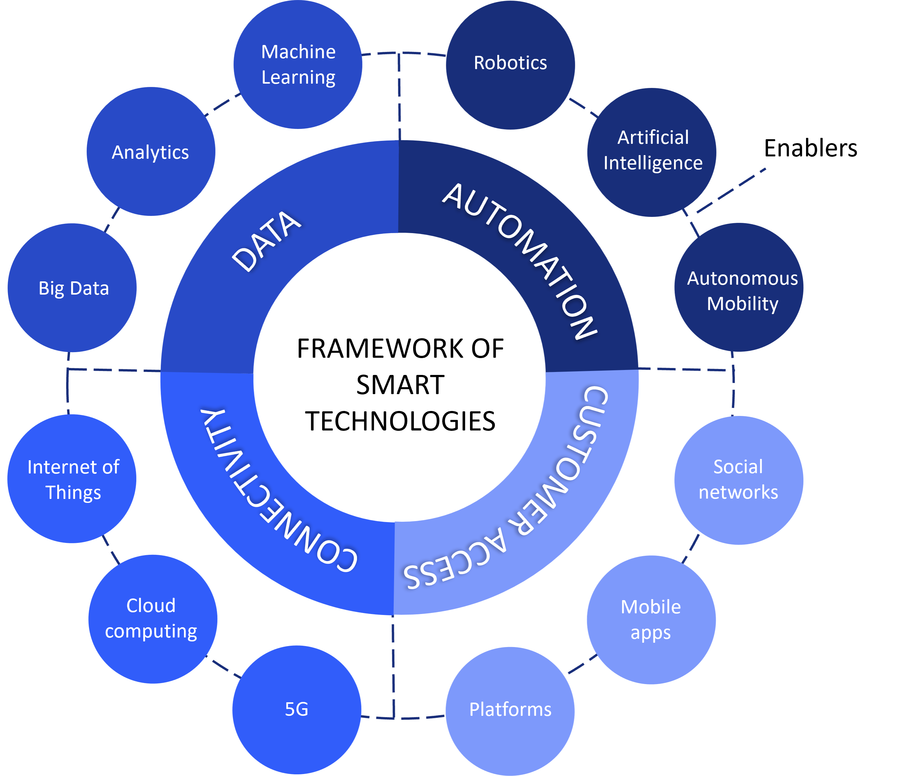
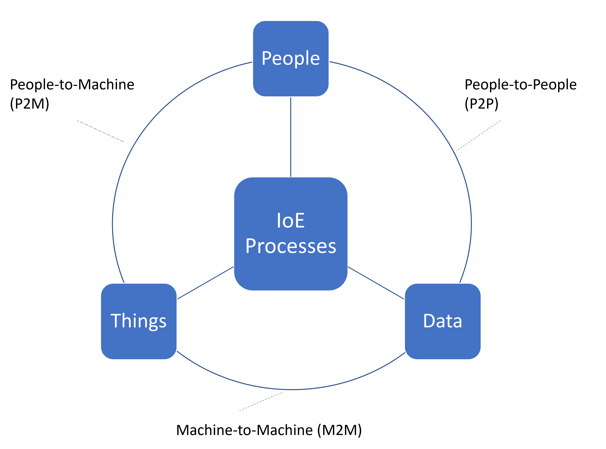

**Smart organizations are constantly changing, adapting their structures, resources, and objectives as they evolve to overcome the inertia that impedes change. Building a transformation strategy on top of the [dynamic capabilities](/posts/tackling-smart-transformation-by-developing-dynamic-capabilities/) and [ambidexterity](/posts/the-art-of-ambidexterity-crucial-for-organizational-transformation/) of the organization, and through the implementation of multiple simultaneous projects is an effective way to reduce risks and have better cost performance.**

This approach when setting the business transformation strategy is different when organizations perceive the need to transform as a result of episodic external events (aka, disruptions) that alter a previous equilibrium situation and that affect the organization's internal structures, forcing them to be replaced by others. 

So, let's start by clarifying what the differences are between an episodic approach to transformation and one that is continuous in nature so that we can then better understand what areas to act on to shape your transformation strategy.

## Continuous vs Episodic Transformation
The continuous transformation approach to business transformation entails a micro-level perspective, as opposed to the macro-level involved in the episodic transformation approach. 

The former does not only respond to external changes that abruptly shake the organization at specific moments (i.e., when a new technology appears), but is substantially driven by the continuous evolution of the contextual conditions in which the organization operates (i.e., by the continuous interaction with customers, the evolution of customers’ consumption expectations, etc.).

It is precisely the constant evolution of the environmental conditions that surround the company, and the complexity derived from the growing interconnection between the actors involved in business ecosystems, which determines the degree of transformation that the company will require: from continuous incremental micro-adaptations to more profound selective changes that introduce new organizational configurations (Fig.1). 

Fig.1: Alternative approaches to business transformation strategy setup (Source: own elaboration)

Ultimately, any business organization should always remain aligned with the contextual/environmental conditions in which it operates, seeking an adequate balance between continuous and episodic change.

## Which Approach is Better? 
Equilibrium situations are not expected to be reached any time soon after external changes or disruptions occur in a business ecosystem. Rather, very often changes occur in cascade and their consequences are unpredictable for most organizations.

For this reason, it would be better for transformational leaders to approach their transformation strategies from the paradigm of continuous change, which means assuming that the organization and its structure become malleable and are always prepared to address endless micro changes that will occur continuoulsy over time.

However, despite the predominance that, in my view, the continuous change approach has, the above does not rule out the need for companies to respond to episodic or disruptive changes that may occur in its business environment, even more so when these episodic changes can be the precursors of continuous changes.

## Transformation Strategy: From Theory to Practice
All activities aimed at implementing a business transformation strategy and creating value for the organization must be converted into concrete actions. Hence, transformational leaders should always remember that deciding to implement technologies alone is not going to add direct value to the organization.

Only when transformational leaders become aware of the specific context in which technologies operate and pursue specific and ambitious transformation goals will the company discover new ways to create value. 

A successful smart transformation strategy will depend on the emphasis that leaders place on preparing the organization’s value creation processes for change, acting more specifically in these five areas that are discussed below:

- Value offerings
- Value network
- Digital channels
- Business model
- Organizational agility

Acting upon these areas can be a powerful source of inspiration to create innovative products and services, optimize key business processes, improve decision-making, and evolve to an agile culture that finally leads to a smart data-driven organization.

### Create New and Distinct Value Offerings
Smart technologies provide the ability for companies to create new value offerings from reviewing or expanding their existing portfolio of products and services. 

These new value offerings are determined by the organization’s ability to collect and analyze data on customers from their interactions with the products and services, as well as by incorporating increasingly innovative elements into them. 

A paradigmatic example of the creation of new value offerings through smart technologies is Airbnb, whose value offering is based on the ability to collect information from customers and partners and use the new insights thus created to better understand how customers travel and what accommodations they prefer when visiting a travel destination. By being able to put this new knowledge into action Airbnb provides customers with real-time solutions in the form of accommodation recommendations that best suit their preferences. 

When companies equip themselves with the right smart technologies and capabilities (Fig.2), they are opening up new possibilities to better understand customer needs and preferences and deliver the experiences that customers want, how, where, and when they demand them.  

Fig. 2: Framework of smart technologies (Source: own elaboration based on Roland Berger, 2015)

Furthermore, companies are much closer to creating personalized value offerings and implementing value co-creation initiatives aimed at deepening customer engagement.

### Redefine the Ecosystem By Forging New Value Networks
Smart technologies make it possible for companies to redefine value networks across the whole business ecosystem. 

On the one hand, smart technologies give customers and users the ability to become co-creators of value, facilitating continuous communication and interaction between them and companies through online platforms, communities, social media, or online channels enabled by the companies themselves. 

On the other hand, smart technologies facilitate interaction and direct exchanges between value network participants (i.e., customers, users, companies), bypassing intermediaries and favoring new collaborative relationships between the different actors focused on value creation.

As collaboration and coordination ties are strengthened between the different actors operating in the ecosystem, more complex and omnidirectional relationships emerge between the stakeholders of the ecosystem that can end up creating more value for the customer. 

In view of these positive effects, it is key that transformational leaders encourage stakeholders to engage with smart technologies that promote the joint creation of value.

Implement Distribution Channels that Bridge the Physical-Digital Gap
Smart technologies have a significant impact on distribution and sales channels, through which many companies are redefining the way they deliver value to the customer. 

Companies are using smart technologies to create new direct and bidirectional touch points and communication channels with their customers and users (i.e., social media, chatbots, IoE, communities) that foster continuous dialogue with them and close the gap between the physical and digital world (Fig.3).

Fig. 3. Internet of Everything. Source: own elaboration based on Miraz et al. (2015)

Likewise, the use of sensors and technologies based on IoT, although still at an early stage, may contribute to making the operation of supply chains and the provision of products and services more efficient through the automation of tasks and data-driven decision-making.

### Innovate Your Business Model
Business model transformation can create new value for organizations, especially when the new models are based on emerging technological developments and the provision of innovative services to customers. 

In some cases, the new business models completely transform the way organizations behave and compete until they practically become technology companies, such as those that offer to connect companies with users, or users with other users. 

In other cases, business models provide value offerings aimed at satisfying certain customer needs, such as those with lower incomes or those seeking a very particular or specialized need/experience.

There are alternative business models that aim to create new value using disruptive technologies to find solutions to problems related to sustainability or the shared economy. This is the case, for example, of the new business models arising from sustainable mobility (i.e., car and bike sharing), which lead to new products and services that improve the customer experience. 

In recent years, business models based on digital platforms have also emerged that facilitate communication and connection between the different actors in the business ecosystem. An example are reservation and exchange platforms in the accommodation sector (i.e., Booking.com, Airbnb), which create new value propositions for customers based on cost reduction and the integration of value-added services.

### Gain Speed with Organizational Agility
Smart technologies can help companies cope with changes in their environment and adapt more quickly to them. This is possible when companies speed organizational agility, which means developing the ability to acquire knowledge about the environment, detect opportunities, and be able to coordinate responses quickly and accurately. 

Systems combining Big Data, data analytics, AI, and IoT provide a huge amount of information and processing capacity that can be used by companies to detect untapped opportunities, increase customer knowledge, and, ultimately, create new customer-centric value. 

Through smart technologies companies can anticipate the preferences of its customers and offer personalized experiences based on the accumulated knowledge of the customer and the conditions of the context. In this way, smart technologies can drive ambidexterity into the organization, as they encourage exploration through smart innovation and exploitation of existing resources.

## Conclusion
A business transformation strategy must necessarily have a wide scope and include far-reaching initiatives. It should seek to integrate and give coherence to the set of apparently independent or unconnected initiatives carried out by the organization, such as those related to products, customers, markets, or distribution. 

Due to its transversal nature, any well-designed transformation strategy will cross the boundaries of all other strategies of the firm, including the business and technological strategy. 

A good business transformation strategy goes beyond the conventional approach of change strategies focused on processes, since it must include a broad repertoire of changes, some of which are disruptive and can affect products and services, resource allocation, and the business model. 

Unlike a digitalization strategy, a business transformation strategy has a much broader scope and pursues more ambitious goals. Furthermore, its effects extend to products, processes, and organizational aspects, which is why it requires a governance framework capable of integrating all the initiatives that result from the integrated use of smart technologies with the power of data and shared knowledge.

Being aware of where the organization is with regard to its business transformation strategy is crucial to avoid taking false steps. In this article we have outlined the fundamental aspects that every transformational leader should never forget if they want to succeed in designing and successfully focusing their business transformation strategy in the right direction.

Photo by <a href="https://www.nasa.gov/sites/default/files/thumbnails/image/artemis_i_launch_nhq202211160029.jpg" target="_blank">NASA</a>

