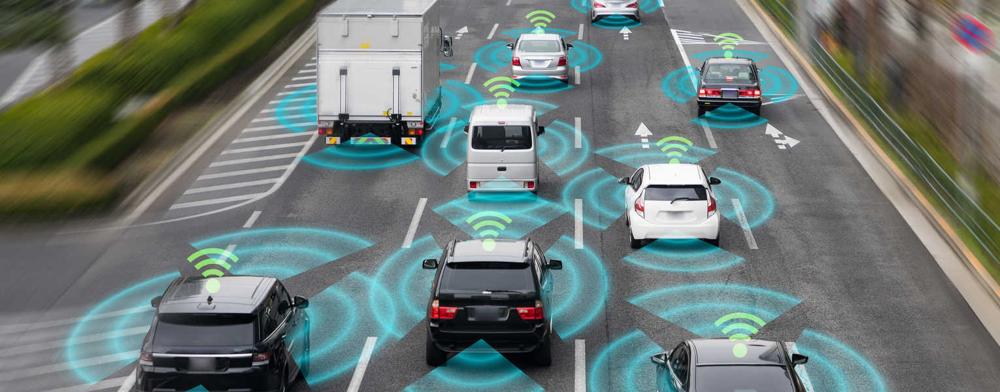

**Connected and autonomous vehicles (CAVs) have the potential to disrupt industries and consumer behavior, transforming urban spaces, modes of transportation use, and a significant portion mobility-related employment. The arrival of CAVs on the market will generate a new world of business and social opportunities that, however, are not free from challenges and threats.**

CAVs are much more than "autonomous taxis" and "constructive policy dialogue", they raise concrete questions about how to design the cities in which we will live, where businesses will be located and how consumer experiences will be designed.

## CAVs Will Disrupt Industries

At the epicenter of CAV innovation are urban environments, whose spatial morphology will gradually transform along with business activities to accommodate CAVs. CAVs also have the potential to shift current mobility practices, as well as impact the way public administrations raise revenue through vehicle taxes, the livelihoods of transport drivers, and, in general, the viability of transportation systems as we know them.

CAV navigation will gradually relegate the driver to a "hands-off", "feet-off" role (with or without the ability to quickly regain control of the vehicle) to reach a fully automated mode in its most advanced stage.

According to some optimistic forecasts, CAVs could start to hit the mass market as early as 2025, first in parts of Asia, Europe, and the US, and later becoming the leading mode of road transport globally in the 2040s. Basically, this means that all industries will gradually transform and that transformational leaders will have to act sooner rather than later.

Source: metamorworks

This potential for transformative change will create tremendous opportunities for new and existing players both in the automotive industry and beyond. In fact, the world's leading vehicle manufacturers have been developing automated driving capabilities for years, and new entrants in the motor industry, like Google, Apple, and Uber, now compete to develop commercially viable advanced technologies for fully equipped automated vehicles. Still, CAVs need to overcome numerous challenges related to security, cost, and customer perceptions to achieve full implementation.

## A New Logic In The Use Urban Space

CAVs will transform industries in the coming years and will contribute to reconfiguring the urban space, creating new challenges that will put the automobile industry, consumers, and transformational leaders to the test.

It is possible that by improving the travel experience and reducing travel costs, there will be an increase in the induced demand for mobility by residents and travelers. But higher levels of CAV use could negatively affect efforts made to encourage responsible use of public transport by people, potentially leading to overcrowding in the form of hordes of small CAVs congesting urban spaces.

In a scenario like this, there would foreseeably be a shortage of urban land available for parking, which would call into question the planning of city centers. Better mobility conditions could make people want to travel longer distances for work, entertainment, or for business or leisure trips, which could encourage people to move their places of residence to more distant places, taking advantage of lower property costs. The result would be greater urban sprawl and greater dependence on the automobile, with people perhaps turning to private vehicles and public or shared transportation declining.

> This potential for transformative change will create tremendous opportunities for new and existing players both in the automotive industry and beyond.

As CAVs grow in popularity new urban business locations could emerge, either as new attractions that used to be difficult to access, or secondary locations now emerging as new venues due to more affordable transport connectivity. The new mobility facilitated by the CAV could redefine what is the "commercial district" or the "center" of cities, by connecting urban spaces in ways never seen before. In short, CAVs could affect the flows and experiences of urban and interurban mobility.

## The CAV Business Model

There are also many questions about which business models will prevail in the CAV market. With the shared (on-demand) CAV model, up to ten privately owned vehicles could be replaced by each shared CAV, and trips would surely be more affordable and attractive to tourists. However, CAV users would be forced to spend time with strangers in the confined space of the cabin, which in some cultural contexts may be considered unacceptable due to the expectation of having to interact.

On the other hand, the environmental benefits of CAVs will depend on the shared/private ownership models and the type of propulsion with which these vehicles are equipped. Although CAVs for urban use are most likely to be electric vehicles, it should not be forgotten that some electric vehicles have higher overall emissions than combustion engine vehicles, and that the true emissions reduction of electric vehicles depends on the production processes and fuels for electrification.

## New Ethical Questions Will Arise

Last but not least, certain ethical, security, and privacy concerns will arise in the development and use of CAVs. For example, what will be the degree of protection that passengers traveling in a CAV must have. Should CAVs be programmed to protect passengers above all else, even when the safety of those outside may be threatened?

> There are also many questions about which business models will prevail in the CAV market.

The death of some pedestrians due to accidents caused by CAVs in the USA has drawn the attention of the media and opened a public debate about the limits of the automation of these vehicles. Not to mention the possible malicious use that terrorists or people with murderous intentions could make of CAVs, which could be directed against the crowds in busy urban areas.

Finally, there is also the issue of the privacy of the personal data recorded during the trips made in the CAVs, as well as the data related to the places visited, the routes taken, the travel times, the stops made, etc., which that could be used to direct advertising or marketing actions to the occupants.

## Conclusion

Achieving some or all of the benefits that CAVs promise will depend not only on the degree of intelligence and automation offered by CAV technologies, but also on fundamental questions related to the governance of the new mobility framework, such as vehicle ownership models (i.e., shared versus private); the ratio of CAVs versus non-CAVs on the roads; the public regulations that will govern the use of CAV; and how the transformation process is led by transformational leaders who want to bet on its advantages.

Many plans are underway around the world to continue expanding the use of CAVs, mainly as sustainable transport solutions that help overcome congestion and pollution in daily and daytime urban commutes. By totally or partially eliminating the driver, the cost of mobility would be drastically reduced, forcing industries to adapt their business models to a new reality in the way people move and interact.

Photo by story <a href="https://www.freepik.es/vector-gratis/ilustracion-concepto-coche-autonomo_19184615.htm" target="_blank">Freepik</a>

