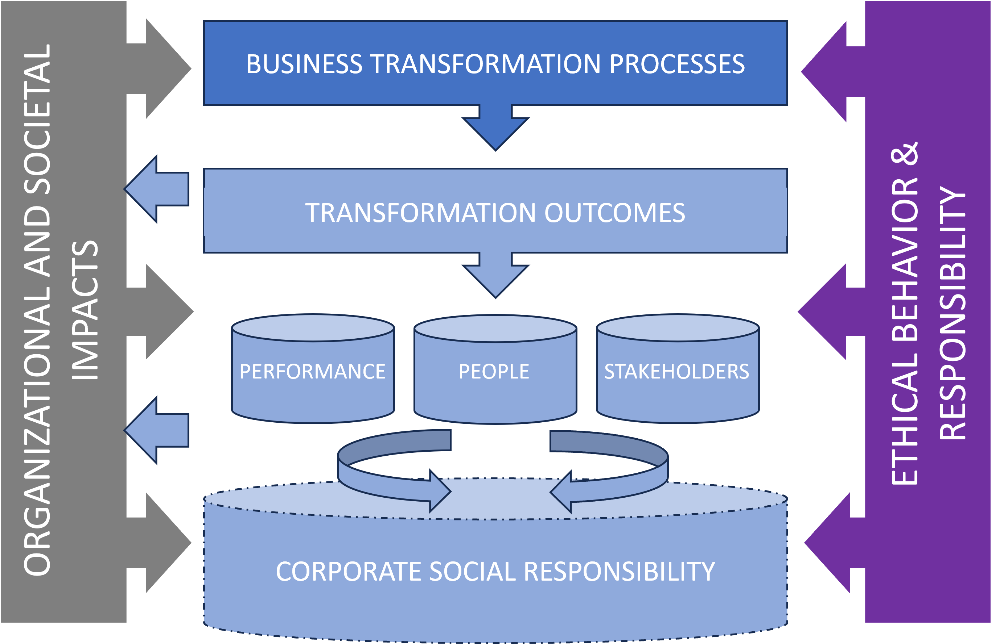

**Ethical considerations arising from business transformation often go unnoticed by transformational leaders, let alone by the ICT industry and other stakeholders who should pay close attention to this key driver of transformation.**

As elusive as it often seems, ethical behavior and responsibility in business transformation, as in other complex decision-making environments, play a crucial role in helping organizations achieve their business goals and establish a solid foundation on which to build a fluid transformation flow.

By properly examining the ethical considerations that arise from business transformation, transformational leaders can gain new perspectives to understand both the transformation processes themselves and the new organizational and societal impacts that are emerging as a result of transformation (Fig. 1).

Fig.1 The ethical dimension within the framework of business transformation (Source: own elaboration)

## Ethics in the Era of Data

The importance of ethics becomes more apparent as business transformation becomes more and more data-driven, extends to an ever-increasing number of actors, and becomes deeper and irreversible for most organizations.

The massive adoption of data by organizations in virtually every industry and the implementation of smart technologies are factors that will drive innovation and support competitive advantage. 

However, these profound transformation processes are beginning to raise ethical issues that, if not adequately addressed, can undermine the credibility of many organizations and call into question the way in which they implement their transformation roadmap, with the consequent negative impact on performance and results.

> Failing to address the ethical considerations of transformation can undermine the credibility of many organizations

Transformational leaders must begin to answer questions like: How are fundamental values such as privacy, security, equality, transparency, and autonomy going to be affected in a world dominated by Big Data and smart technologies? Should some data be a public good? To what extent will consumers be willing to reveal personal data in exchange for making society/business safer and more efficient?

Whatever the answers, the bottom line is that transformational leaders need to start deciding how they plan to implement ethical practices within the organization (e.g., ethical Big Data, ethical analytics, ethical AI) and how these practices are going to be communicated both within and outside the organization.

Ultimately, ethics should not be viewed as a burden to be met, but as a complementary approach that will help transformational leaders envision new, multifaceted perspectives on transformation processes. In other words, the above does not mean that ethics should be used as a safeguard against the way (data-driven) transformation is taking place, but rather as an additional dimension that should help organizations strike a better balance between the elements that drive change and those that sustain performance over time.

> Ethics should be seen as a complementary approach that helps transformational leaders envision multifaceted perspectives of transformation

## Ethics and Employees

A key aspect that transformational leaders must pay attention to when addressing the ethical considerations that arise from transformation is the relationship that exists between them and the employees of the organization.

Transformational leaders must strive to ensure that business objectives do not conflict with the moral views of their employees, even though this may sometimes be contradictory to the company's own financial objectives.

Transformational leaders must seek to align business model decisions with employee values and principles, as well as keep all the capabilities offered by data and smart technologies on the same ethical plane as those of their users.

To illustrate the relevance of this topic, take the case of Google and see how the company changed its well-known motto “Don’t be evil” in the 2018 Code of Ethics revision to its equally popular statement: “And remember … don’t be evil and if you see something that you think isn’t right – speak up!”

Despite this powerful claim, the tech company has been criticized many times in recent years by US regulators and its broad community of critics for the way key ethical issues are handled at the corporate level and by its employees.

> Transformational leaders will seek to align business model decisions with employee values and principles at all times

## Ethics and Performance

As the business environment becomes more complex, the possibility for a company to maintain full control over its level of performance becomes a challenge. In this context, ethics can guide transformational leaders in the design and use of new technologies and processes that facilitate the achievement of business objectives in the short term, while maintaining the company's level of performance in the long term. 

For example, some companies may try to increase their proximity to the customer and personalize their experiences by anticipating latent preferences that are not always made explicit through primary and secondary data sources. Although these practices may be profitable for the company’s performance in the short term, they are sometimes shown to be undesirable in the long term, not because they are illegal, but because some stakeholders consider them morally reprehensible.

> Ethics plays a key role in enabling transformational leaders to more easily achieve short- and long-term business goals

Therefore, transformational leaders must remain vigilant to these risks, as customers and other stakeholders are bound to become critical if certain moral values are violated. In addition, it is important for companies to demonstrate that they are using data responsibly and are not only focused on the business case.

To properly assess ethical risks, every transformational leader should begin by taking the customer's point of view and asking themselves: Would the customer agree to disclose their data if they knew exactly what was being done with it? What are the possible benefits that customers would be willing to accept to provide their data ?

Ultimately, transformational leaders must review the ethical foundations currently in force in their organizations (i.e., corporate social responsibility) in light of business transformation, incorporating new areas of interest such as ethical performance, data governance, etc. By doing so, companies will gain a much more complete and rich understanding of the transformation phenomenon that will surely allow them to approach the change process more successfully.

> Transformational leaders must review the ethical foundations currently in force in their organizations in light of business transformation

## Ethics and Stakeholders

As value creation networks increase in complexity, companies must satisfy the multiple, sometimes contradictory, demands of value co-creators. This issue becomes even more apparent in digital ecosystems such as platforms that, by definition, rely on multiple parties and for which data is at the core of their competitive value proposition.

Transformational leaders must develop the ability to balance the demands of multiple parties, without compromising the performance of the company or its ability to maintain its competitive advantages over time.

At times this may require the company to redefine perceptions of what is considered right and wrong. For example, for a platform owner, an ethical challenge may be how to ensure that one party’s demands are not met at the expense of others (i.e., if the platform grants access to the data to one party, then the other party should not perceive it as a breach of security and privacy).

> Transformational leaders must develop the ability to balance the demands of multiple parties, without compromising the overall performance of the company

## Conclusion

Ethical considerations in the context of business transformation and the ethical behavior of transformational leaders is a subject that has been little studied to date. In fact, there are still many decisions that affect transformation processes whose impact on the results and performance of organizations lacks an adequate ethical understanding.

Most research on transformation in business organizations has focused on the effects it has on innovations, performance, and the factors that affect its adoption among users and consumers, or how it can become a source of competitive advantage. 

Nevertheless, most innovations produced by transformation have social and individual impacts of an ethical nature that are much broader and go far beyond simple statements and that transformational leaders must carefully consider.

If transformational leaders don't commit the necessary attention and resources that ethics demands, don't do it with the right focus, or just don't do it at the right time, they will find ethics becoming an issue with a strong negative impact on organizational results.

Ethics cannot be a matter of trial and error to find the broadest possible limits to impose a particular business vision regardless of customers, people and stakeholders, but rather it must be originally incorporated into the transformation plans of organizations by design, putting first the vision of customers, people, and stakeholders. 

If you transformational leader think about sustaining results in the long term, this is the right way to go.

Photo by <a href="https://www.freepik.es/foto-gratis/naturaleza-muerta-que-ilustra-concepto-etica_26407570.htm#page=2&query=ethics&position=49&from_view=search&track=sph" target="_blank">Freepik</a>

